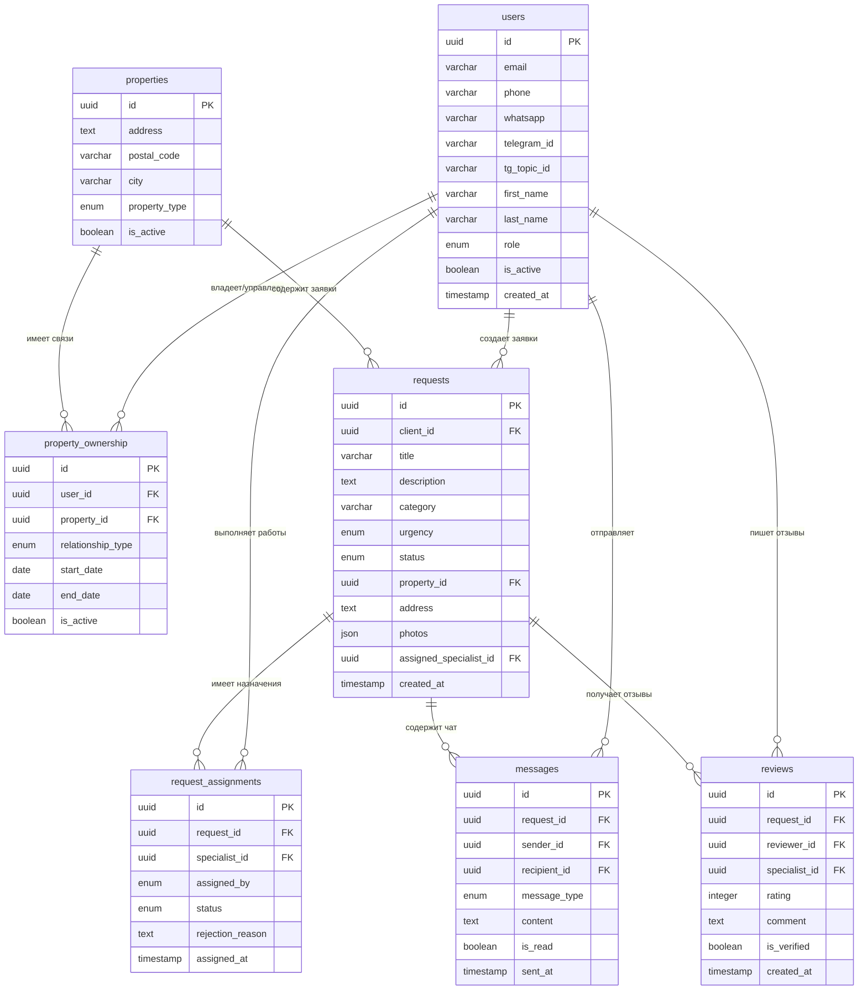

# База данных AssetCare24 - Прототип

**Дата:** 2025-12-12
**Версия:** 0.1 (Прототип)
**Цель:** Минимальный набор таблиц для тестирования базового функционала
**Принципы:** Простота + Качественная архитектура для расширения

---

## ОБЗОР АРХИТЕКТУРЫ

### Базовые таблицы прототипа (7 таблиц)
Мы начинаем с минимального набора сущностей, необходимых для работы прототипа:

1. **users** - Все пользователи системы (5 ролей)
2. **properties** - Объекты недвижимости
3. **property_ownership** - Связи пользователей с объектами
4. **requests** - Заявки на обслуживание
5. **request_assignments** - Назначения заявок специалистам
6. **messages** - Сообщения в чатах
7. **reviews** - Отзывы о выполненных работах

### Принципы проектирования
- **UUID** для всех первичных ключей (готовность к масштабированию)
- **timestamps** для аудита (created_at, updated_at)
- **soft delete** поле (is_active) для восстановления данных
- **indexes** на часто используемые поля для производительности

---

## ОПИСАНИЕ ТАБЛИЦ И ПОЛЕЙ

### 1. users (Пользователи)
**Назначение:** Единая таблица для всех типов пользователей (hausverwalter, eigentumer, mieter, handwerker, unternehmer)

| Поле | Тип | Описание | Обязательно | Индекс |
|------|-----|----------|-------------|---------|
| id | UUID | Первичный ключ | ✅ | PK |
| email | VARCHAR(255) | Email адрес | ❌ | UNIQUE |
| phone | VARCHAR(20) | Телефон | ✅ | INDEX |
| whatsapp | VARCHAR(20) | WhatsApp номер | ❌ | - |
| telegram_id | VARCHAR(50) | Telegram ID | ❌ | - |
| tg_topic_id | VARCHAR(50) | ID топика Telegram | ❌ | - |
| first_name | VARCHAR(100) | Имя | ✅ | - |
| last_name | VARCHAR(100) | Фамилия | ✅ | - |
| role | ENUM | hausverwalter/eigentumer/mieter/handwerker/unternehmer | ✅ | INDEX |
| is_active | BOOLEAN | Активен ли пользователь | ✅ (default: true) | - |
| created_at | TIMESTAMP | Дата создания | ✅ | - |
| updated_at | TIMESTAMP | Дата обновления | ✅ | - |

### 2. properties (Объекты недвижимости)
**Назначение:** Информация об объектах (квартиры, дома, коммерческая недвижимость)

| Поле | Тип | Описание | Обязательно | Индекс |
|------|-----|----------|-------------|---------|
| id | UUID | Первичный ключ | ✅ | PK |
| address | TEXT | Полный адрес | ✅ | - |
| postal_code | VARCHAR(10) | Почтовый индекс | ✅ | INDEX |
| city | VARCHAR(100) | Город | ✅ | INDEX |
| property_type | ENUM | apartment/house/commercial | ✅ | INDEX |
| is_active | BOOLEAN | Активен ли объект | ✅ (default: true) | - |
| created_at | TIMESTAMP | Дата создания | ✅ | - |
| updated_at | TIMESTAMP | Дата обновления | ✅ | - |

### 3. property_ownership (Владение/управление недвижимостью)
**Назначение:** Связи пользователей с объектами недвижимости

| Поле | Тип | Описание | Обязательно | Индекс |
|------|-----|----------|-------------|---------|
| id | UUID | Первичный ключ | ✅ | PK |
| user_id | UUID | FK to users | ✅ | FK+INDEX |
| property_id | UUID | FK to properties | ✅ | FK+INDEX |
| relationship_type | ENUM | owner/tenant/manager | ✅ | INDEX |
| start_date | DATE | Дата начала отношений | ✅ | - |
| end_date | DATE | Дата окончания (nullable) | ❌ | - |
| is_active | BOOLEAN | Активна ли связь | ✅ (default: true) | - |
| created_at | TIMESTAMP | Дата создания | ✅ | - |

### 4. requests (Заявки)
**Назначение:** Заявки на выполнение работ

| Поле | Тип | Описание | Обязательно | Индекс |
|------|-----|----------|-------------|---------|
| id | UUID | Первичный ключ | ✅ | PK |
| client_id | UUID | FK to users (заказчик) | ✅ | FK+INDEX |
| title | VARCHAR(200) | Краткое название проблемы | ✅ | - |
| description | TEXT | Подробное описание | ✅ | - |
| category | VARCHAR(50) | Тип работ (electric, plumbing, etc.) | ✅ | INDEX |
| urgency | ENUM | low/medium/high/emergency | ✅ | INDEX |
| status | ENUM | new/assigned/in_progress/completed/cancelled | ✅ | INDEX |
| property_id | UUID | FK to properties | ❌ | FK+INDEX |
| address | TEXT | Адрес выполнения работ | ❌ | - |
| photos | JSON | Массив ссылок на фото | ❌ | - |
| assigned_specialist_id | UUID | FK to users | ❌ | FK+INDEX |
| is_active | BOOLEAN | Активна ли заявка | ✅ (default: true) | - |
| created_at | TIMESTAMP | Дата создания | ✅ | INDEX |
| updated_at | TIMESTAMP | Дата обновления | ✅ | - |
| completed_at | TIMESTAMP | Дата завершения | ❌ | - |

### 5. request_assignments (Назначения заявок)
**Назначение:** История назначений заявок специалистам

| Поле | Тип | Описание | Обязательно | Индекс |
|------|-----|----------|-------------|---------|
| id | UUID | Первичный ключ | ✅ | PK |
| request_id | UUID | FK to requests | ✅ | FK+INDEX |
| specialist_id | UUID | FK to users | ✅ | FK+INDEX |
| assigned_by | ENUM | ai/manual/admin | ✅ | - |
| status | ENUM | pending/accepted/rejected/completed | ✅ | INDEX |
| rejection_reason | TEXT | Причина отказа | ❌ | - |
| assigned_at | TIMESTAMP | Дата назначения | ✅ | - |
| completed_at | TIMESTAMP | Дата завершения | ❌ | - |
| is_active | BOOLEAN | Активно ли назначение | ✅ (default: true) | - |

### 6. messages (Сообщения)
**Назначение:** Сообщения в чатах заявок

| Поле | Тип | Описание | Обязательно | Индекс |
|------|-----|----------|-------------|---------|
| id | UUID | Первичный ключ | ✅ | PK |
| request_id | UUID | FK to requests | ✅ | FK+INDEX |
| sender_id | UUID | FK to users | ✅ | FK+INDEX |
| recipient_id | UUID | FK to users | ✅ | FK+INDEX |
| message_type | ENUM | text/image/voice/file | ✅ | - |
| content | TEXT | Текст сообщения или ссылка на файл | ✅ | - |
| is_read | BOOLEAN | Прочитано ли сообщение | ✅ (default: false) | - |
| sent_at | TIMESTAMP | Дата отправки | ✅ | INDEX |
| is_active | BOOLEAN | Активно ли сообщение | ✅ (default: true) | - |

### 7. reviews (Отзывы)
**Назначение:** Отзывы клиентов о выполненных работах

| Поле | Тип | Описание | Обязательно | Индекс |
|------|-----|----------|-------------|---------|
| id | UUID | Первичный ключ | ✅ | PK |
| request_id | UUID | FK to requests | ✅ | FK+INDEX |
| reviewer_id | UUID | FK to users (клиент) | ✅ | FK+INDEX |
| specialist_id | UUID | FK to users (специалист) | ✅ | FK+INDEX |
| rating | INTEGER | Оценка 1-5 | ✅ | - |
| comment | TEXT | Текстовый отзыв | ❌ | - |
| is_verified | BOOLEAN | Подтвержден ли отзыв | ✅ (default: false) | - |
| created_at | TIMESTAMP | Дата создания | ✅ | INDEX |
| is_active | BOOLEAN | Активен ли отзыв | ✅ (default: true) | - |

---

## СХЕМА СВЯЗЕЙ (ER-диаграмма)

---

## ТЕХНИЧЕСКИЕ РЕШЕНИЯ ПРОТОТИПА

### База данных: Supabase (PostgreSQL)
- **UUID:** Генерация на уровне БД
- **RLS (Row Level Security):** Для безопасности данных
- **Real-time subscriptions:** Для обновления интерфейса

### Индексы для производительности:
- users: phone, role, email
- properties: postal_code, city, property_type
- requests: client_id, status, urgency, created_at
- messages: request_id, sent_at

### Ограничения и правила:
- **NOT NULL** на обязательных полях
- **CHECK constraints** на enums и диапазоны
- **UNIQUE constraints** на email, phone в users

### Следующие шаги расширения:
- Добавление таблиц для платежей (этап 3)
- Таблицы для расписаний специалистов
- Архивные таблицы для аналитики
- Таблицы для файлов и медиа

---

**Прототип готов к разработке!** 🚀

Этот минимальный набор таблиц обеспечит работу базового функционала заявок, чатов и отзывов с возможностью расширения до полноценной платформы.
