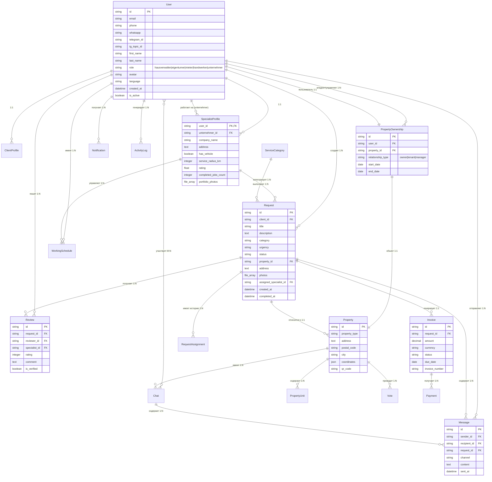

# Сущности платформы AssetCare24

## Обзор
Этот документ содержит полный список сущностей (объектов/моделей данных) платформы AssetCare24, сгруппированных по функциональным областям. Для каждой сущности указаны основные поля и пометка о необходимости на этапах 1-3 (в рамках текущего договора).

**Легенда этапов:**
- 🔴 **Этап 0 (нулевой)**: Минимальный функционал для подачи заявки (даже до договора)
- 🟡 **Этап 1**: MVP (WhatsApp + базовый веб, 4000€)
- 🟢 **Этап 2**: Тестирование и пилот (1000€)
- 🔵 **Этап 3**: Автоматизация и расширение (3000€)

---

## 1. Пользователи и аутентификация

### 1.1 User (Пользователь)
Базовая сущность для всех типов пользователей системы.

**Основные поля:**
- id (UUID)
- email (string)
- phone (string, основной для коммуникаций)
- whatsapp (string, WhatsApp номер)
- telegram_id (string, Telegram ID пользователя)
- tg_topic_id (string, ID топика в Telegram)
- first_name (string)
- last_name (string)
- role (enum: hausverwalter, eigentumer, mieter, handwerker, unternehmer)
- avatar (file, опционально)
- language (enum: de, en, ru)
- created_at (timestamp)
- updated_at (timestamp)
- is_active (boolean)

**Этапы:**
- 🔴 Этап 0: id, phone, first_name, role (для базовой работы)
- 🟡 Этап 1: все поля
- 🟢 Этап 2: avatar, language
- 🔵 Этап 3: полная валидация и расширенные настройки

### 1.2 SpecialistProfile (Профиль специалиста)
Расширение User для handwerker (мастеров).

**Основные поля:**
- user_id (FK to User)
- unternehmer_id (FK to User, nullable - для мастеров, работающих на компании)
- company_name (string, опционально)
- address (text)
- license_number (string, опционально)
- has_drivers_license (boolean)
- has_vehicle (boolean)
- service_radius_km (integer: 5, 10, 20, 50)
- working_hours (json: {monday: "9-17", ...})
- specializations (array of strings)
- rating (float: 0-5)
- completed_jobs_count (integer)
- response_time_avg (minutes)
- is_verified (boolean)
- portfolio_photos (array of files)
- created_at, updated_at

**Этапы:**
- 🔴 Этап 0: user_id, specializations, rating, completed_jobs_count (для базовой статистики)
- 🟡 Этап 1: все базовые поля без portfolio_photos
- 🟢 Этап 2: portfolio_photos, is_verified, unternehmer_id
- 🔵 Этап 3: response_time_avg, working_hours

### 1.3 PropertyOwnership (Владение/управление недвижимостью)
Связи пользователей с объектами недвижимости.

**Основные поля:**
- id (UUID)
- user_id (FK to User)
- property_id (FK to Property)
- relationship_type (enum: owner, tenant, manager)
- start_date (date)
- end_date (date, nullable)
- created_at (timestamp)

**Связи по ролям:**
- **Mieter (арендатор)**: 1 пользователь ↔ 1 объект (tenant)
- **Eigentümer (собственник)**: 1 пользователь ↔ N объектов (owner)
- **Hausverwalter (управляющий)**: 1 пользователь ↔ N объектов (manager)

**Этапы:**
- 🟡 Этап 1: базовые связи
- 🟢 Этап 2: relationship_type, даты
- 🔵 Этап 3: история изменений

### 1.3 ClientProfile (Профиль клиента)
Расширение User для клиентов.

**Основные поля:**
- user_id (FK to User)
- preferred_contact_method (enum: whatsapp, email, phone)
- address_book (array of addresses)
- total_requests (integer)
- satisfaction_rating (float)
- created_at, updated_at

**Этапы:**
- 🔴 Этап 0: user_id (базовый)
- 🟡 Этап 1: все поля
- 🟢 Этап 2: address_book
- 🔵 Этап 3: satisfaction_rating

---

## 2. Заявки и заказы

### 2.1 Request (Заявка)
Основная сущность заявки на обслуживание.

**Основные поля:**
- id (UUID)
- client_id (FK to User)
- title (string)
- description (text)
- category (enum: cleaning, repair, maintenance, etc.)
- urgency (enum: low, medium, high, emergency)
- status (enum: new, assigned, in_progress, completed, cancelled)
- property_id (FK to Property, опционально)
- address (text)
- photos (array of files) ⭐ КРИТИЧЕСКИ ВАЖНО ДЛЯ ЭТАПА 0
- videos (array of files, опционально)
- voice_messages (array of files, опционально)
- assigned_specialist_id (FK to User, nullable)
- estimated_cost (decimal)
- actual_cost (decimal)
- created_at (timestamp)
- updated_at (timestamp)
- completed_at (timestamp, nullable)
- ai_analysis (json: category detection, urgency assessment)

**Этапы:**
- 🔴 Этап 0: id, client_id, description, photos, address, status, created_at ⭐ ОСНОВНОЙ ФУНКЦИОНАЛ
- 🟡 Этап 1: все поля без videos, voice_messages, ai_analysis
- 🟢 Этап 2: videos, voice_messages
- 🔵 Этап 3: ai_analysis, estimated_cost, actual_cost

### 2.2 RequestAssignment (Назначение заявки)
История назначений заявок специалистам.

**Основные поля:**
- id (UUID)
- request_id (FK to Request)
- specialist_id (FK to User)
- assigned_by (enum: ai, manual, admin)
- assigned_at (timestamp)
- status (enum: pending, accepted, rejected, completed)
- rejection_reason (text, nullable)
- completed_at (timestamp, nullable)

**Этапы:**
- 🔴 Этап 0: request_id, specialist_id, status (для просмотра работником)
- 🟡 Этап 1: все поля
- 🟢 Этап 2: assigned_by, rejection_reason
- 🔵 Этап 3: расширенная логика назначения

---

## 3. Объекты недвижимости

### 3.1 Property (Объект недвижимости)
Информация об объектах (квартиры, дома, коммерческая недвижимость).

**Основные поля:**
- id (UUID)
- owner_id (FK to User)
- manager_id (FK to User, nullable)
- property_type (enum: apartment, house, commercial)
- address (text)
- postal_code (string)
- city (string)
- coordinates (json: lat, lng)
- floor (integer, nullable)
- apartment_number (string, nullable)
- rooms_count (integer)
- area_sqm (decimal)
- year_built (integer)
- has_elevator (boolean)
- parking_spaces (integer)
- qr_code (string, generated)
- created_at, updated_at

**Этапы:**
- 🔴 Этап 0: address, postal_code, city (для заявок)
- 🟡 Этап 1: все базовые поля
- 🟢 Этап 2: coordinates, qr_code
- 🔵 Этап 3: полная информация для управляющих

### 3.2 PropertyUnit (Единица объекта)
Для многоквартирных домов - отдельные квартиры/офисы.

**Основные поля:**
- id (UUID)
- property_id (FK to Property)
- unit_number (string)
- owner_id (FK to User)
- tenant_id (FK to User, nullable)
- area_sqm (decimal)
- rooms_count (integer)
- qr_code (string)

**Этапы:**
- 🟡 Этап 1: базовые поля
- 🟢 Этап 2: qr_code
- 🔵 Этап 3: полная интеграция

---

## 4. Коммуникации

### 4.1 Message (Сообщение)
Система сообщений (WhatsApp, веб-чаты).

**Основные поля:**
- id (UUID)
- sender_id (FK to User)
- recipient_id (FK to User)
- request_id (FK to Request, nullable)
- channel (enum: whatsapp, web, telegram)
- message_type (enum: text, image, voice, file)
- content (text)
- attachments (array of files)
- sent_at (timestamp)
- read_at (timestamp, nullable)
- is_from_ai (boolean)

**Этапы:**
- 🟡 Этап 1: базовые текстовые сообщения
- 🟢 Этап 2: attachments, voice
- 🔵 Этап 3: AI-ассистент

### 4.2 Chat (Чат)
Групповые чаты по объектам.

**Основные поля:**
- id (UUID)
- property_id (FK to Property)
- name (string)
- type (enum: property_general, maintenance, voting)
- participants (array of user_ids)
- created_by (FK to User)
- created_at (timestamp)

**Этапы:**
- 🔵 Этап 3: базовый функционал

---

## 5. Оценки и отзывы

### 5.1 Review (Отзыв)
Отзывы клиентов о специалистах.

**Основные поля:**
- id (UUID)
- request_id (FK to Request)
- reviewer_id (FK to User - client)
- specialist_id (FK to User)
- rating (integer: 1-5)
- comment (text, nullable)
- categories (json: punctuality, quality, communication)
- is_verified (boolean - только после оплаты)
- created_at (timestamp)

**Этапы:**
- 🔴 Этап 0: rating, comment, created_at (для портфолио специалиста) ⭐ ВАЖНО ДЛЯ РАБОТНИКА
- 🟡 Этап 1: все поля без categories
- 🟢 Этап 2: categories, is_verified
- 🔵 Этап 3: аналитика отзывов

---

## 6. Финансы

### 6.1 Invoice (Счет)
Счета за выполненные работы.

**Основные поля:**
- id (UUID)
- request_id (FK to Request)
- client_id (FK to User)
- specialist_id (FK to User)
- amount (decimal)
- currency (string: EUR)
- status (enum: draft, sent, paid, overdue)
- due_date (date)
- paid_at (timestamp, nullable)
- payment_method (enum: paypal, card, bank_transfer)
- invoice_number (string, auto-generated)
- pdf_url (string)

**Этапы:**
- 🟢 Этап 2: базовые счета
- 🔵 Этап 3: полная биллинг-система

### 6.2 Payment (Платеж)
История платежей.

**Основные поля:**
- id (UUID)
- invoice_id (FK to Invoice)
- amount (decimal)
- method (string)
- transaction_id (string)
- status (enum: pending, completed, failed)
- processed_at (timestamp)

**Этапы:**
- 🔵 Этап 3: интеграция платежных систем

---

## 7. Голосования и коллективное управление

### 7.1 Vote (Голосование)
Голосования для коллективной собственности.

**Основные поля:**
- id (UUID)
- property_id (FK to Property)
- title (string)
- description (text)
- options (array of strings)
- created_by (FK to User)
- voting_period_start (timestamp)
- voting_period_end (timestamp)
- status (enum: draft, active, completed)
- results (json)

**Этапы:**
- 🔵 Этап 3: базовый функционал голосований

---

## 8. Система и аналитика

### 8.1 ActivityLog (Лог активности)
История всех действий в системе.

**Основные поля:**
- id (UUID)
- user_id (FK to User)
- action (string)
- entity_type (string)
- entity_id (UUID)
- details (json)
- created_at (timestamp)

**Этапы:**
- 🟡 Этап 1: базовый лог
- 🔵 Этап 3: расширенная аналитика

### 8.2 Notification (Уведомление)
Система уведомлений.

**Основные поля:**
- id (UUID)
- user_id (FK to User)
- type (enum: request_assigned, message_received, payment_due)
- title (string)
- message (text)
- is_read (boolean)
- created_at (timestamp)

**Этапы:**
- 🟡 Этап 1: базовые уведомления
- 🔵 Этап 3: умные уведомления

---

## 9. Категории и справочники

### 9.1 ServiceCategory (Категория услуг)
Справочник услуг.

**Основные поля:**
- id (UUID)
- name (string)
- description (text)
- icon (string)
- parent_id (FK self, nullable)
- is_active (boolean)

**Этапы:**
- 🟡 Этап 1: базовые категории
- 🔵 Этап 3: иерархия категорий

### 9.2 WorkingSchedule (График работы)
График специалиста.

**Основные поля:**
- id (UUID)
- specialist_id (FK to User)
- date (date)
- start_time (time)
- end_time (time)
- is_available (boolean)
- booked_request_id (FK to Request, nullable)

**Этапы:**
- 🔵 Этап 3: управление расписанием

---

## Критически важные поля для Этапа 0

**Для клиента (подача заявки):**
- Request.photos (массив файлов изображений)
- Request.address (текстовый адрес)
- Request.description (описание проблемы)
- Request.category (тип проблемы)

**Для специалиста (просмотр и статистика):**
- SpecialistProfile.rating (рейтинг)
- SpecialistProfile.completed_jobs_count (кол-во выполненных работ)
- Review.rating + Review.comment (отзывы)
- Request.status (статус заявок)
- Request.created_at (дата создания для месячной статистики)

**Это позволяет даже на самом базовом этапе иметь рабочую систему подачи заявок с фото и базовую панель специалиста.**

---

# Диаграмма связей сущностей (ER-диаграмма)

