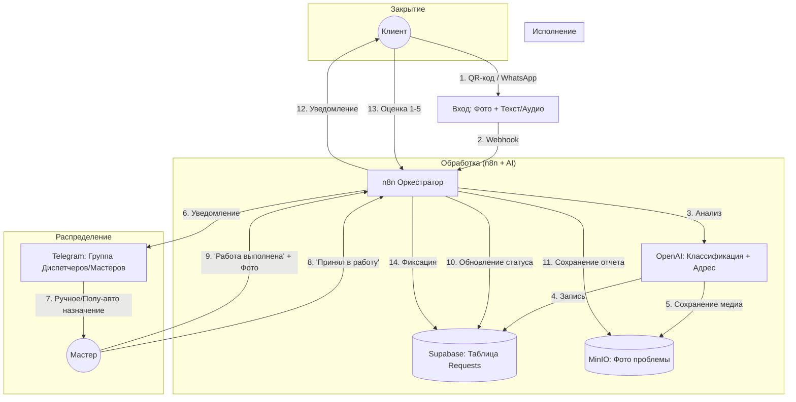

# Главный информационный поток (MVP Core Flow)

**Цель MVP:** Обеспечить прохождение заявки от возникновения проблемы до её решения с минимальным ручным вмешательством диспетчера.

---

## Схема "Золотого пути" (Happy Path)

Поток движется по одной линии: **Проблема → Регистрация → Назначение → Исполнение → Закрытие.**

---

## Детальное описание шагов

### 1. Инициация (Вход)
*   **Источник:** Клиент сканирует QR-код (в подъезде/квартире).
*   **Канал:** WhatsApp (приоритет) или Веб-форма (резерв).
*   **Данные:**
    1.  Фото проблемы (Обязательно/Желательно).
    2.  Голосовое или текст (Описание).
    3.  Номер телефона (Автоматически из WhatsApp).

### 2. Регистрация и Анализ (Ядро n8n)
*   **Действие:** n8n принимает данные.
*   **AI (OpenAI):**
    *   Транскрибирует аудио (Whisper).
    *   Анализирует текст/фото: определяет категорию (Сантехника/Электрика) и Срочность.
    *   Извлекает адрес (если пользователь уже есть в БД — подтягивает по номеру телефона).
*   **Хранение:**
    *   Создается запись в таблице `requests` (Status: `new`).
    *   Файлы загружаются в MinIO: `/requests/{uuid}/problem.jpg`.

### 3. Маршрутизация (Упрощенная для MVP)
*   *Вместо сложного алгоритма подбора:*
*   **Действие:** n8n отправляет сообщение в **Telegram-группу "Диспетчерская"** (где сидят админы и проверенные мастера).
*   **Содержание:** "Новая заявка! [Адрес] [Категория] [Фото]. Кто берет?"
*   **Назначение:** Мастер нажимает кнопку (или пишет) "Беру", Админ закрепляет заявку за ним в системе (через простую команду или админку Supabase).
*   *Опционально:* Если мастер известен (закреплен за домом), n8n шлет ему в личный WhatsApp.

### 4. Исполнение
*   **Мастер:** Получает детали заявки в WhatsApp.
*   **Старт:** Нажимает "Начал работу" (опционально для GPS трекинга).
*   **Финиш:** Отправляет в бот фото результата.
*   **Система:** Обновляет статус заявки на `completed`, сохраняет фото результата в MinIO.

### 5. Закрытие и Сервис
*   **Клиент:** Получает сообщение: "Ваша заявка [ID] выполнена. Пожалуйста, оцените работу".
*   **Оценка:** Клиент ставит 1-5 звезд.
*   **Финансы:** Система генерирует простой PDF-счет (или ссылку на оплату) и отправляет клиенту (если услуга платная).

---

## Сервисные (Вспомогательные) ветки

Эти функции обслуживают главный поток, но не блокируют его:

1.  **Регистрация Пользователя:** Если номер телефона новый → Бот спрашивает Имя и Адрес (один раз).
2.  **Регистрация Мастера:** Отдельный QR-код → Анкета → Одобрение Админом.
3.  **Биллинг:** Простая генерация PDF по шаблону в конце месяца или по факту.

